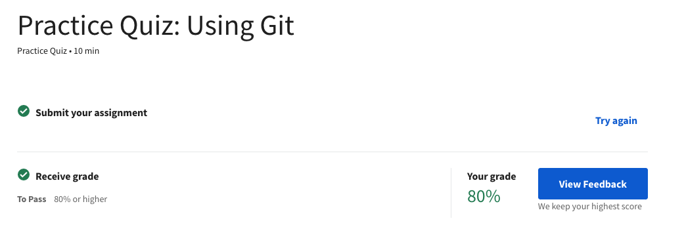
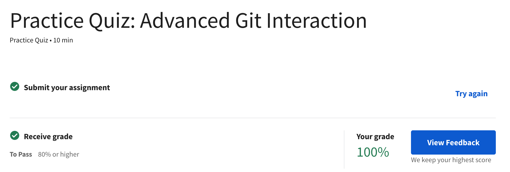
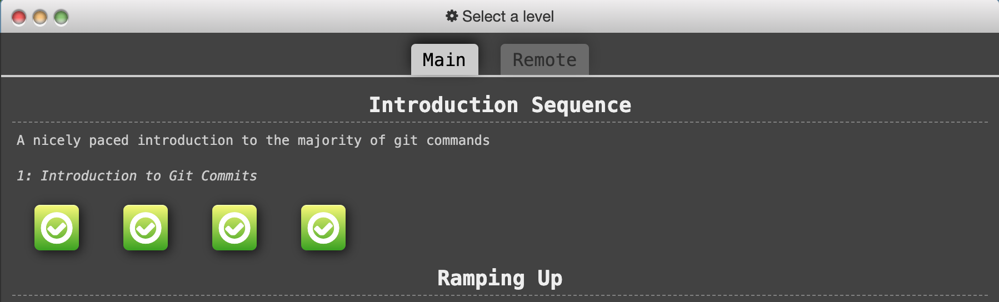
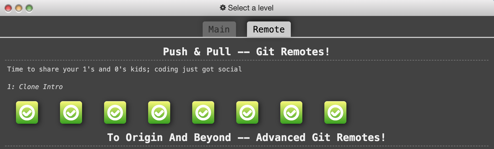

# kottans-frontend
Training repository for the Frontend course from Kottans

# BIO
Hello eweryone! I am Anatolii and I want to become a front end developer.

The repository was created for educational purposes with *Kottans*. I will post here the progress and success of the training.

## Skills before Trainining:
- Superficial knowledge of GIT
- English - pre-intermediate

# Stage_0
- [x] Git, GitHub, git flow
- [ ] Linux, командний рядок, основи нетворкінгу
- [ ] HTML, CSS
- [ ] JS basics
- [ ] Frontend framework basics (React)
- [ ] TypeScript basics

# Git, GitHub, git flow

**Studied in this module:**

- Listened part of the course [Introduction to Git and GitHub](https://www.coursera.org/learn/introduction-git-github)

>The course well and clearly explained the basics of GIT.
I got a lot of useful information about commits and branches from this course.

	
Results:

	
	

  

- Passed sections "*Introduction Sequence*
" and "*Push & Pull*" of the simulator [learngitbranching.js.org](https://learngitbranching.js.org/)

>For my mind, the tasks lack realism. in real use, the commands are more detailed.

	
Results:

	
	

  

_______________________

## Linux CLI, and HTTP

- Passed [Linux Survival](https://linuxsurvival.com/linux-tutorial-introduction/)

> I had a basic knowledge of the structure of the directory tree in Unix systems and the basic commands in the terminal. The course helped to extend my knowledge and make practice in "zsh".

	
"Linux Survival" Quiz results:

	
	

	
	

	
	

	

- Familiarized with HTTP from articles:
	- [HTTP: The Protocol Every Web Developer Must Know—Part 1](https://code.tutsplus.com/uk/tutorials/http-the-protocol-every-web-developer-must-know-part-1--net-31177)
	- [HTTP: The Protocol Every Web Developer Must Know—Part 2](https://code.tutsplus.com/uk/tutorials/http-the-protocol-every-web-developer-must-know-part-2--net-31155)

> I got a basic understanding of client-server communication. I would not say that this information is very interesting :) but definitely useful. I had to use additional sources to understand some aspects of the article.