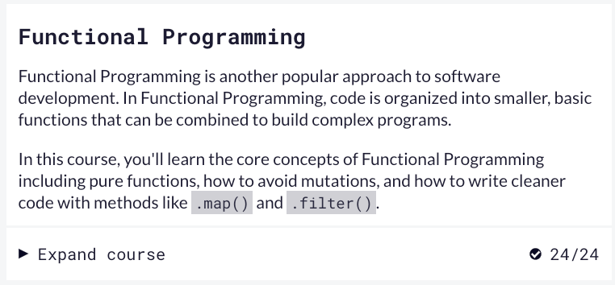

# kottans-frontend

The repository was created for educational purposes with _Kottans_. I will post here the progress and success of the training.

---

## BIO

Hello everyone! I am Anatolii and I want to become a front-end developer ;).

## Skills before Trainining:

- Basic knowledge of GIT
- Basic knowledge of Unix-based OS
- Basic knowledge of HTML CSS
- English - pre-intermediate

---

# Stage_0

- [x] General
  - [x] [Git Basics](#git-github-git-flow)
  - [x] [Linux CLI and Networking](#linux-cli-and-http)
  - [x] [VCS (hello gitty), GitHub and Collaboration](#git-collaboration)
- [ ] Front-End Basics
  - [x] [HTML, CSS](#intro-to-html-and-css)
  - [x] [Responsive Web Design](#responsive-web-design)
  - [x] [html & css practice](#html-css-popup)
  - [x] [JavaScript Basics](#js-basics)
  - [ ] [Document Object Model]()
- [ ] Advanced Topics
  - [x] [Building a Tiny JS World (pre-OOP) - practice](#building-a-tiny-js-world)
  - [ ] [Object oriented JS - practice]()
  - [ ] [OOP exercise - practice]()
  - [ ] [Offline Web Applications - optional]()
  - [ ] [Memory pair game — real project!]()
  - [ ] [Website Performance Optimization - optional]()
  - [ ] [Friends App - real project!]()

## Git, GitHub, git flow

_Studied in this module_

- Listened part (weeks 1,2) of the course [Introduction to Git and GitHub](https://www.coursera.org/learn/introduction-git-github)

Results:

	
	

	
		

			
Quizes results:

			
			

			
			

			
			

			
			

			
			

			
		

> The course well and clearly explained the basics of GIT.
> I got a lot of useful information about commits and branches from this part of the course.

- Passed "_Introduction Sequence_" chapter in the _*Main*_ section and "_Push & Pull_" chapter in the _*Remote*_ section of the simulator [learngitbranching.js.org](https://learngitbranching.js.org/)

	
Results:

	
	

  

> The training was interesting and useful for understanding the GIT workflow and a little practice.

## Linux CLI, and HTTP

_Studied in this module_

- Passed [Linux Survival](https://linuxsurvival.com/linux-tutorial-introduction/)

	
"Linux Survival" Quiz results:

	
	

	
	

	
	

	

> I had a basic knowledge of the structure of the directory tree in Unix systems and the basic commands in the terminal. The course helped to extend my knowledge and make practice in "zsh".

- Familiarized with HTTP from articles:
  - [HTTP: The Protocol Every Web Developer Must Know—Part 1](https://code.tutsplus.com/uk/tutorials/http-the-protocol-every-web-developer-must-know-part-1--net-31177)
  - [HTTP: The Protocol Every Web Developer Must Know—Part 2](https://code.tutsplus.com/uk/tutorials/http-the-protocol-every-web-developer-must-know-part-2--net-31155)

> I got a basic understanding of client-server communication. I would not say that this information is very interesting :) but definitely useful. I had to use additional sources to understand some aspects of the article.

## Git Collaboration

_Studied in this module_

- Listened final part (weeks 3,4) of the course [Introduction to Git and GitHub](https://www.coursera.org/learn/introduction-git-github)

	
Results:

		
		

		
			

			
Quizes results:

			
			

			
			

			
			

			
			

			
			

			
		

> I got a lot of useful information about working with remote repositories from this part of the course. This knowledge can be implemented in work even now and will be useful in the future.

- Passed "_Ramping Up_, _Moving Work Around_, _A Mixed Bag_" chapters in the _*Main*_ section and "_To Origin And Beyond -- Advanced Git Remotes!_" chapter in the _*Remote*_ section of the simulator [learngitbranching.js.org](https://learngitbranching.js.org/)

	
Results:

	
	

	

> It was already a little easier to complete these tasks because I already figured out the simulator. Although some tasks made me think about the implementation.

## Intro to HTML and CSS

_Studied in this module_

- Passed week 1 and week 2 of the course [Intro to HTML & CSS](https://www.coursera.org/learn/html-css-javascript-for-web-developers) from coursera.

	
Results:

	
	

	

> The course was easy to follow since I previously know the basics of HTML and CSS. Topics about semantics in HTML and the CSS selectors specificity hierarchy were new and interesting to me.

- Passed [Learn HTML](https://www.codecademy.com/learn/learn-html) course from Codecademy.

	
Results:

	

> The information from this course almost duplicates the information from the course from Coursera, but it's very cool that there is an opportunity to practice online. An interesting and new topic for me was the validation of input fields.

- Passed [Learn CSS](https://www.codecademy.com/learn/learn-css) course from Codecademy.

	
Results:

	

> An interesting and new topic from this part of the course was TYPOGRAPHY and connecting the external fonts.

## Responsive Web Design

_Studied in this module_

- Read the article [Responsive web design basics](https://web.dev/i18n/en/responsive-web-design-basics/)

  > I learned a lot of useful information from the article, which I will apply in future projects.

- Watched the mini-course:[FLEXBOX. Вчимося верстати на флексах](https://www.youtube.com/playlist?list=PLM6XATa8CAG5mPV60dMmjMRrHVW4LmV2x)

> It was useful and interesting content, the examples given by the author are especially helpful in understanding. I will use the cheat sheets provided by the author of the video :).

- Passed the game [Flexbox Froggy](http://flexboxfroggy.com/).

	
Results:

	

> I passed the game without difficulties. The game didn't take long.

- Watched the mini-course:[CSS Grid Layout](https://www.youtube.com/watch?v=GV92IdMGFfA&list=PLM6XATa8CAG5pXQrW_kDaeZb_uIAMNZIm)

> Like the previous mini-course, this one was useful and interesting, the example allows me to better understand and consolidate the material.

- Passed the game [Grid Garden](http://cssgridgarden.com/)

	
Results:

	

> The game did not cause any problems but task 26 got me thinking.

## HTML-CSS-Popup

[Demo](https://anatolii-petrenko.github.io/popup-task-html-css/)

> This task helps better understand how and when flex should be applied and when will be better to apply grids. Also, it was a great practice of working with classes, especially with the namings of the classes. I will use the knowledge gained during this task in future projects.

## JS Basics

It was not easy for me to pass the tasks. I spent more than two weeks completing all the necessary tasks. Unfortunately some of the tasks I couldn't solve at all without hints. Surprisingly, the passage of "Algorithm Scripting Challenges" was easier than others for me, perhaps because I gradually started to understand on which side to approach the task.
I hope that it will turn out to apply the acquired knowledge in practice in the subsequent practical tasks.

	
Вступ до JS:

	

	
Basic JavaScript:

	

	
ES6 Challenges:

	

	
Basic Data Structures:

	

	
Basic Algorithm Scripting:

	

	
Functional Programming:

	

	
Algorithm Scripting Challenges:

	

## DOM

_Studied in this module:_

- Document Object Model Manipulation:

	
Quiz:

	

- freecodecamp Algorithm Scripting Challenges

	
Passed Tasks:

	

## Building a Tiny JS World

[Demo](https://anatolii-petrenko.github.io/a-tiny-JS-world/)
